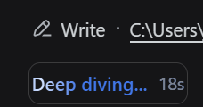
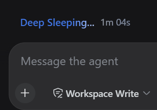
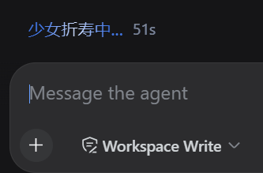
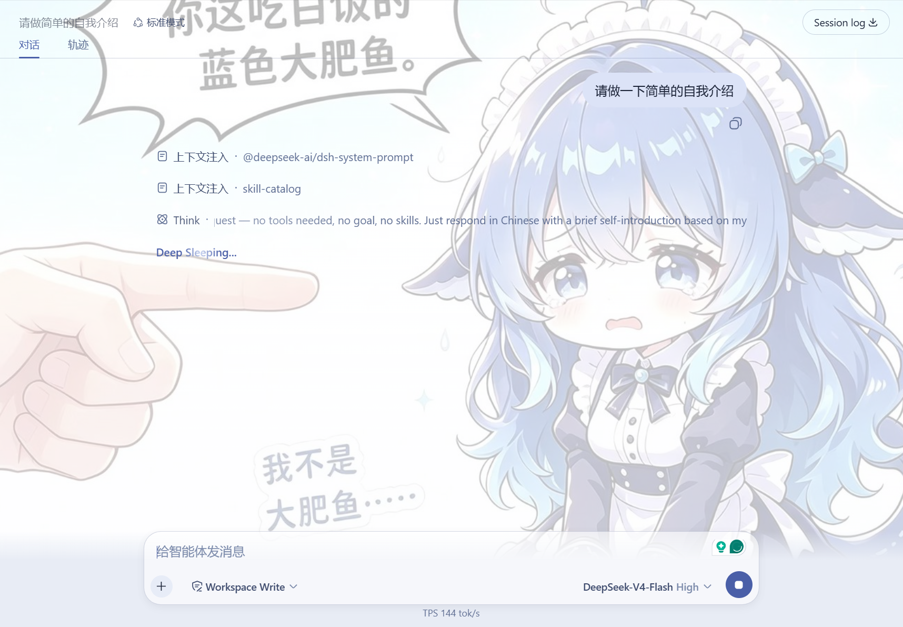

[中文版](README.md)

# dsh-plugin-working-status

One line: click the "Deep diving..." status text, type whatever you actually want it to say, and it stays that way everywhere, forever.

## Quick install

```sh
dsh plugin --profile web add github:Abyss-Seeker/dsh-plugin-working-status
```

Then enable the row in `$DSH_HOME/profiles/web/cordis.patch.yml` (see "Installation" below) and reload the GUI page.

## What it does

- **Click to edit.** Click the status label (or the clock next to it), edit in place, press `Enter` or click away to save, `Esc` to chicken out.
- **One edit, everywhere.** The new text applies to every current and future turn, in every session — across reloads and restarts.
- **Empty commit restores the default.** Clear the field and save to go back to the built-in text. The default is captured from the live render, so it follows whatever the UI actually shows, in any language.
- **Nothing else is touched.** Only the label's text node changes: the shimmer animation, the elapsed-time clock, the ARIA live region, and the loading-time render all stay exactly as they are.

## How to edit

Click "Deep diving..." and edit it directly:



## What it looks like

| Effect one | Effect two |
| --- | --- |
|  |  |

## Installation

One command:

```sh
dsh plugin --profile web add github:Abyss-Seeker/dsh-plugin-working-status
```

Then enable the row in the profile's patch layer, `$DSH_HOME/profiles/web/cordis.patch.yml`:

```yaml
- insert:
    - id: working-status-editor
      name: dsh-plugin-working-status
```

Reload the GUI page. No build step is involved — the checked-in `lib/` is the artifact. `file:` paths and registry package names work the same way; a pnpm-free fallback lives in `scripts/install.mjs`.

## Plugin configuration card

After installation, Settings → Plugins → Plugin configuration gains a "Working status" card: the same field, with Save, Discard, and Reset to default, writing the exact same value as the click-to-edit flow.

## Plays well with dsh-web-ui

If you also run dsh-web-ui (SSH, task board, that family), both coexist fine — one card each, nobody steps on anybody:



## Persistence, honestly

- Today the text lives in a localStorage mirror (`dsh.turn-status.label`): shared across every tab of the origin, kept across reloads and restarts.
- The Host half also registers the `turn-status` settings namespace, but the current DSH API gateway only serves its fixed allowlist to browsers (`WEB_SETTINGS_NAMESPACES` in `dsh-host-apiproxy`); anything else gets `settings-not-exposed` even when registered. Letting plugins expose configuration from `settings.register()` itself is marked deferred work in that package. When it lands, this plugin switches to Host storage automatically with localStorage as the fallback — your text is safe either way.

## Diagnostics and compatibility

- `window.__dshWorkingStatusEditor` exposes `elements()` (currently matched status fields) and `label()` (the effective label).
- The status field is found via `role="status"` + `aria-live="polite"` + the stable `turnStatus` CSS-module local name. If a future DSH renames that class, the plugin warns and stops rewriting instead of breaking the page.
- The configuration card registers into the `settings.plugin.item` slot declared by `ui-settings-plugins`; without that surface, click-to-edit still works.

## Development

- `test/smoke.mjs` exercises replacement, commit/cancel/reset, the card form, and persistence sync against a fake DOM. Run it after changes.
- To sync edited sources into a profile: re-run the install command above, or `node scripts/install.mjs "$DSH_HOME/profiles/web"`.
